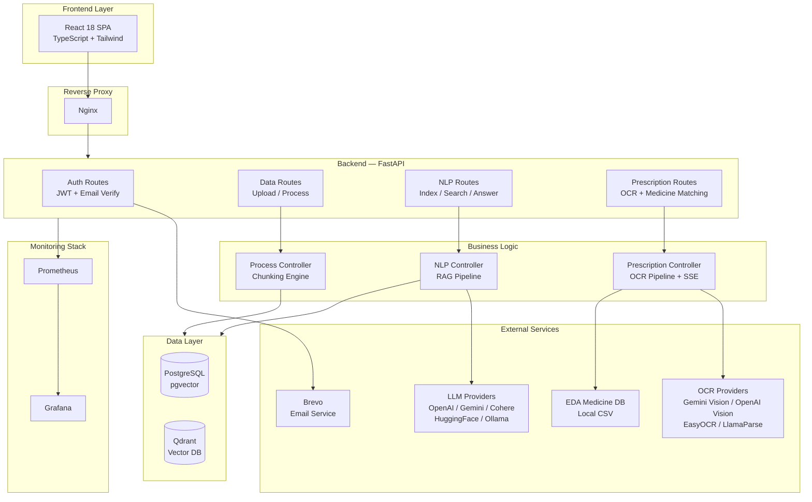

<![CDATA[# RxTract

> **AI-Powered Prescription Analyzer & RAG System** — Upload prescriptions, get instant medicine analysis with real alternatives from the Egyptian Drug Authority (EDA), and ask questions about your documents using Retrieval-Augmented Generation.

---

## ✨ Key Features

### 🔬 Prescription Analysis (OCR → AI)
- **Multi-provider OCR**: Supports Gemini Vision, OpenAI Vision, EasyOCR, and LlamaParse
- **Intelligent medicine extraction**: Algorithmic fallback when LLM extraction fails
- **Real-time progress**: Server-Sent Events (SSE) stream each pipeline step to the UI
- **EDA medicine matching**: Fuzzy-matches extracted medicines against the Egyptian Drug Authority database and suggests real alternatives
- **End-to-end pipeline**: OCR → Extraction → Enrichment → Database Matching → Response

### 📄 RAG Document Q&A
- **Multi-format ingestion**: PDF, TXT, Markdown, JSON, CSV, DOCX
- **Hybrid search**: Dense vector search + BM25 sparse retrieval with configurable alpha blending
- **Multiple LLM providers**: OpenAI, Google Gemini, Cohere, HuggingFace, and Ollama (local)
- **Multiple vector databases**: PostgreSQL with pgvector or Qdrant
- **Semantic search**: Natural language queries across indexed documents

### 🔐 Security & Auth
- **JWT authentication**: Secure login/register with token-based access control
- **Email verification**: Brevo (Sendinblue) integration for account verification
- **Prompt injection guard**: Detects and blocks injection attempts in user queries
- **Content filtering**: Output leakage prevention for sensitive data
- **Rate limiting**: Per-IP rate limiting via SlowAPI

### 📊 Monitoring & Observability
- **Prometheus metrics**: Custom application metrics with auto-instrumented endpoints
- **Grafana dashboards**: Pre-configured visualization for system health
- **Node Exporter**: Hardware and OS metrics from the host machine
- **PostgreSQL Exporter**: Database-level performance metrics

---

## 🏗️ Architecture



---

## 🚀 Getting Started

### Prerequisites

| Tool | Version | Purpose |
|------|---------|---------|
| **Python** | 3.11+ | Backend runtime |
| **Node.js** | 18+ | Frontend build |
| **pnpm** | latest | Frontend package manager |
| **Docker** | 20+ | Database containers |
| **uv** | latest | Python dependency management (recommended) |

### Option A: Hybrid Development (Recommended)

> Docker runs only the databases. Backend and frontend run locally for fast iteration with hot-reload.

#### 1. Clone the Repository

```bash
git clone https://github.com/mohamedfathi540/rxtract.git
cd rxtract
```

#### 2. Configure Environment

```bash
cd SRC
cp .env.example .env
```

Open `.env` and configure your API keys and preferences:

| Variable | Description | Example |
|----------|-------------|---------|
| `GENRATION_BACKEND` | LLM provider | `OPENAI`, `GEMINI`, `COHERE`, `HUGGINGFACE`, `OLLAMA` |
| `EMBEDDING_BACKEND` | Embedding provider | `GEMINI`, `HUGGINGFACE`, `OPENAI` |
| `OCR_BACKEND` | Prescription OCR provider | `GEMINI`, `OPENAI`, `EASYOCR`, `LLAMAPARSE` |
| `VECTORDB_BACKEND` | Vector database | `PGVECTOR`, `QDRANT` |
| `JWT_SECRET` | Token signing key | Generate with `python3 -c "import secrets; print(secrets.token_hex(32))"` |
| `BREVO_API_KEY` | Email verification API key | Get from [Brevo Dashboard](https://app.brevo.com) |

> **⚠️ Important:** Change `JWT_SECRET` from the default value before deploying to production.

#### 3. Start Everything with One Command

```bash
cd ..   # Return to project root
bash dev.sh
```

This script will:
1. 🐳 Start **PostgreSQL (pgvector)** and **Qdrant** via Docker
2. ⏳ Wait for databases to become healthy
3. 🐍 Launch the **FastAPI backend** with hot-reload on port `8000`
4. ⚛️ Launch the **Vite frontend** with HMR on port `5777`
5. 📋 Tail all logs in your terminal

**To stop everything:**
```bash
# Press Ctrl+C in the running terminal
# OR run:
bash dev-stop.sh
```

#### 4. Access the Application

| Service | URL |
|---------|-----|
| **Frontend** | http://localhost:5777 |
| **API Docs** | http://localhost:8000/docs |
| **PostgreSQL** | `localhost:5433` |
| **Qdrant Dashboard** | http://localhost:6333/dashboard |

---

### Option B: Full Docker Deployment (Production)

> Everything runs inside Docker containers, including Nginx reverse proxy and monitoring.

```bash
cd Docker
# Configure environment files in Docker/env/
docker compose up -d --build
```

| Service | URL |
|---------|-----|
| **Application** | http://localhost (via Nginx) |
| **API** | http://localhost:8000 |
| **Grafana** | http://localhost:3000 |
| **Prometheus** | http://localhost:9090 |

See [Docker/README.md](Docker/README.md) for detailed configuration.

---

## 📖 System Workflow

### 1. User Registration & Login

```
Register → Email Verification (Brevo) → Login → JWT Token → Access Protected Routes
```

### 2. Prescription Analysis Pipeline

```
Upload Image → OCR (Vision AI) → Extract Medicines → Match EDA Database → Return Alternatives
```

Each step streams real-time progress via SSE:

| Step | Description |
|------|-------------|
| **OCR** | Extracts raw text from the prescription image using the configured vision provider |
| **Extraction** | Identifies medicine names, dosages, and instructions from the raw OCR text |
| **Enrichment** | Cross-references extracted medicines with the EDA database (~40,000+ products) |
| **Response** | Returns structured results with real alternatives and pricing |

### 3. RAG Document Pipeline

```
Upload Document → Process (Chunk) → Generate Embeddings → Index in Vector DB → Query
```

| Step | Endpoint | Description |
|------|----------|-------------|
| **Upload** | `POST /api/v1/data/upload/{project_id}` | Upload PDF, TXT, MD, JSON, CSV, or DOCX |
| **Process** | `POST /api/v1/data/process/{project_id}` | Split into configurable chunks |
| **Index** | `POST /api/v1/nlp/index/push/{project_id}` | Embed and store in vector database |
| **Search** | `POST /api/v1/nlp/index/search/{project_id}` | Semantic similarity search |
| **Answer** | `POST /api/v1/nlp/index/answer/{project_id}` | RAG-powered Q&A with context |

### 4. Medicine Database Update

Update the local EDA medicine database:

```bash
uv run python3 SRC/scripts/scrape_eda.py
```
1. Solve the CAPTCHA shown in `captcha.jpg`
2. Results saved to `SRC/Assets/Files/eda_medicines.csv`

---

## 📁 Project Structure

```
rxtract/
├── SRC/                          # Backend — FastAPI Application
│   ├── main.py                   # App entry point, middleware, router setup
│   ├── Routes/                   # API endpoint definitions
│   │   ├── Auth.py               # Register, login, email verification
│   │   ├── Data.py               # File upload, processing, asset management
│   │   ├── NLP.py                # Vector indexing, search, RAG Q&A
│   │   └── Prescription.py       # OCR analysis with SSE streaming
│   ├── Controllers/              # Business logic layer
│   │   ├── NLPController.py      # RAG pipeline + hybrid search
│   │   ├── PrescriptionController.py  # OCR pipeline + medicine matching
│   │   └── ProcessController.py  # Document chunking engine
│   ├── Stores/                   # External service integrations
│   │   ├── LLM/                  # LLM providers (OpenAI, Gemini, Cohere, HuggingFace)
│   │   ├── VectorDB/             # Vector DB providers (pgvector, Qdrant)
│   │   └── Sparse/               # BM25 sparse retrieval
│   ├── Utils/                    # Utilities
│   │   ├── security.py           # JWT auth + password hashing
│   │   ├── PromptGuard.py        # Prompt injection detection
│   │   ├── ContentFilter.py      # Output leakage prevention
│   │   ├── MedicineMatcher.py    # Fuzzy medicine matching against EDA DB
│   │   ├── email_service.py      # Brevo email verification
│   │   └── metrics.py            # Prometheus metrics setup
│   ├── Models/                   # SQLAlchemy models + Alembic migrations
│   ├── scripts/                  # Utility scripts
│   │   ├── scrape_eda.py         # EDA medicine database scraper
│   │   └── process_embeddings.py # Batch embedding processor
│   └── .env.example              # Environment template
│
├── frontend/                     # Frontend — React SPA
│   ├── src/
│   │   ├── pages/                # Application pages
│   │   │   ├── PrescriptionPage  # OCR analysis with progress streaming
│   │   │   ├── ChatPage          # RAG Q&A interface
│   │   │   ├── SearchPage        # Semantic search
│   │   │   ├── UploadPage        # Document upload & processing
│   │   │   ├── LoginPage         # Authentication
│   │   │   ├── RegisterPage      # User registration
│   │   │   └── VerifyEmailPage   # Email verification
│   │   ├── components/           # Reusable UI components
│   │   ├── stores/               # Zustand state (auth, settings)
│   │   └── api/                  # API client layer
│   └── index.html                # App shell
│
├── Docker/                       # Docker deployment
│   ├── docker-compose.yml        # Full production stack
│   ├── docker-compose.dev.yml    # Dev-only (databases)
│   ├── Nginx/                    # Reverse proxy config
│   ├── Prometheus/               # Metrics scraping config
│   └── env/                      # Container environment files
│
├── dev.sh                        # 🚀 One-command dev environment launcher
├── dev-stop.sh                   # 🛑 Graceful shutdown script
├── API.md                        # Complete API reference
└── project_workflow.md           # System workflow diagrams
```

---

## ⚙️ Configuration Reference

### LLM Providers

| Provider | Backend Value | API Key Variable | Notes |
|----------|---------------|------------------|-------|
| OpenAI | `OPENAI` | `OPENAI_API_KEY` | Also supports OpenRouter via `OPENAI_BASE_URL` |
| Google Gemini | `GEMINI` | `GEMINI_API_KEY` | Recommended for OCR |
| Cohere | `COHERE` | `COHERE_API_KEY` | Supports Command R+ |
| HuggingFace | `HUGGINGFACE` | `HUGGINGFACE_API_KEY` | Free tier available |
| Ollama | `OPENAI` | Set `OPENAI_API_KEY=ollama` | Local models via custom `OPENAI_BASE_URL` |

### OCR Providers

| Provider | Backend Value | Requires | Best For |
|----------|---------------|----------|----------|
| Google Gemini Vision | `GEMINI` | `GEMINI_API_KEY` | Handwritten prescriptions |
| OpenAI Vision | `OPENAI` | `OPENAI_API_KEY` | General document OCR |
| EasyOCR | `EASYOCR` | Nothing (local) | Offline/privacy-first |
| LlamaParse | `LLAMAPARSE` | API key | Structured documents |

### Vector Database Options

| Database | Backend Value | Default Port | Notes |
|----------|---------------|--------------|-------|
| PostgreSQL + pgvector | `PGVECTOR` | 5433 | Recommended — uses existing PostgreSQL |
| Qdrant | `QDRANT` | 6333 | High-performance, standalone vector DB |

---

## 🌐 Self-Hosting Guide

Turn any computer into a professional RxTract server using Cloudflare Tunnel.

### Phase 1: Hardware & OS

- **Hardware**: Any computer with 4GB+ RAM (old laptop recommended for built-in UPS)
- **Connection**: Ethernet cable for stability
- **OS**: Ubuntu Server 24.04 LTS (enable OpenSSH during installation)

### Phase 2: Install & Deploy

```bash
# SSH into your server
ssh your_username@local_ip

# Install Docker
sudo apt-get update
sudo apt-get install ca-certificates curl
sudo install -m 0755 -d /etc/apt/keyrings
sudo curl -fsSL https://download.docker.com/linux/ubuntu/gpg -o /etc/apt/keyrings/docker.asc
sudo chmod a+r /etc/apt/keyrings/docker.asc

echo \
  "deb [arch=$(dpkg --print-architecture) signed-by=/etc/apt/keyrings/docker.asc] https://download.docker.com/linux/ubuntu \
  $(. /etc/os-release && echo "$VERSION_CODENAME") stable" | \
  sudo tee /etc/apt/sources.list.d/docker.list > /dev/null
sudo apt-get update
sudo apt-get install docker-ce docker-ce-cli containerd.io docker-buildx-plugin docker-compose-plugin

# Clone and start
git clone https://github.com/mohamedfathi540/rxtract.git
cd rxtract/Docker
# Configure your .env files in Docker/env/
docker compose up -d --build
```

### Phase 3: Expose via Cloudflare Tunnel

```bash
# Install cloudflared
curl -L --output cloudflared.deb https://github.com/cloudflare/cloudflared/releases/latest/download/cloudflared-linux-amd64.deb
sudo dpkg -i cloudflared.deb

# Quick test (temporary URL)
cloudflared tunnel --url http://localhost:80

# For permanent setup:
# 1. Create Cloudflare account → Zero Trust → Tunnels
# 2. Public Hostname: rxtract.yourdomain.com → HTTP → localhost:80
```

### Troubleshooting

| Issue | Solution |
|-------|----------|
| Cannot connect to Docker daemon | `docker context use default` or `sudo systemctl start docker` |
| Server restarts after power outage | Configure BIOS → "Power On After Power Failure" |

---

## 📚 Additional Documentation

- **[API Reference](API.md)** — Complete REST API documentation
- **[System Workflow](project_workflow.md)** — Detailed pipeline diagrams
- **[Docker Guide](Docker/README.md)** — Container configuration and management
- **[Frontend Guide](frontend/README.md)** — React SPA setup and structure

## 📝 License

Apache License 2.0 — see [LICENCE](LICENCE) for details.
]]>
